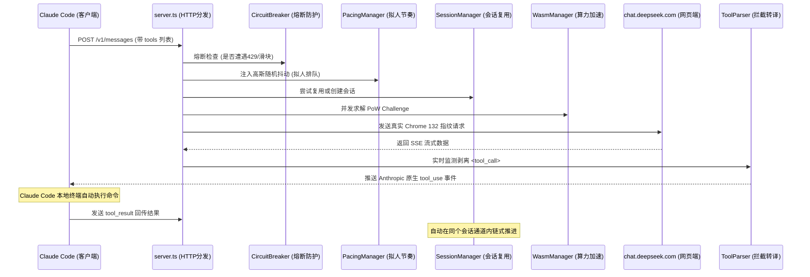

# DeepSeek Web 高性能分层架构与全方位防封号防护指南

本项目为 VS Code 扩展及本地代理服务（默认端口 `9999`），旨在让开发者通过免 API 费用的方式直连 [DeepSeek 网页端 (chat.deepseek.com)](https://chat.deepseek.com)，并在终端（如 Claude Code）中实现原生全自动 Agent 命令行与文件自动化。

本技术文档详细阐述：
1. **系统分层重构架构**
2. **六重全方位防封号与反风控防护体系**
3. **针对高性能宿主机的并发与算力优化**
4. **日常使用避坑与最佳实践**

---

## 🏛️ 一、分层重构架构 (Layered Architecture)

为了实现高内聚、低耦合，并充分发挥高性能电脑的多核与大内存优势，我们将代理核心拆分为 6 个主要层次：

```
src/proxy/
├── config.ts               # 全局配置中心、环境发现与安全阈值常量
├── types.ts                # 跨层通用数据结构 (Tool, Session, PoW, SSE)
├── security/               # 【安全与反风控层】
│   ├── fingerprint.ts      # 真实 Chrome 132 浏览器指纹全模拟 (Client Hints)
│   ├── pacingManager.ts    # 自适应高斯随机抖动与拟人化延迟调度
│   ├── payloadSanitizer.ts # 上下文安全预算与超长工具输出智能折叠
│   └── circuitBreaker.ts   # 429/403/人机滑块智能熔断器
├── pow/                    # 【PoW 算力解算层】
│   └── wasmManager.ts      # 官方同款 WebAssembly 模块管理与零拷贝内存
├── session/                # 【会话调度与管理层】
│   └── sessionManager.ts   # 智能会话复用 (Session Reuse) 与消息拓扑追踪
├── agent/                  # 【Agent 工具转译层】
│   ├── promptInjector.ts   # JSON Schema 转 XML 强约束指令 & Few-shot 重建
│   └── toolParser.ts       # 流式 XML/JSON 拦截器与输入规范化适配
├── protocols/              # 【标准协议适配层】
│   ├── anthropicHandler.ts # Anthropic Messages API (/v1/messages) & SSE 状态机
│   └── openAiHandler.ts    # OpenAI Chat Completions API (/v1/chat/completions)
└── server.ts               # HTTP 路由调度、CORS 与长连接分发中心
```

### 数据流向流程



---

## 🛡️ 二、六重全方位防封号与反风控保护体系

网页端不同于开放平台 API，其背后通常有 Cloudflare WAF、极验（Geetest）以及内部的风控风速模型。针对其核心检测维度，我们建立了 6 重纵深防御：

### 1. 真实现代 Chrome 132 浏览器指纹全模拟
- **被封根因**：原生后端工具（如 Node.js fetch 或 curl）只携带基础 Header，缺少现代浏览器的 Client Hints，是 WAF 封禁脚本的“一号特征”。
- **防护实现** (`fingerprint.ts`)：
  - 完整模拟现代 Chrome 桌面端请求头：
    ```http
    sec-ch-ua: "Not A(Brand";v="8", "Chromium";v="132", "Google Chrome";v="132"
    sec-ch-ua-mobile: ?0
    sec-ch-ua-platform: "Windows"
    Sec-Fetch-Site: same-origin
    Sec-Fetch-Mode: cors
    Sec-Fetch-Dest: empty
    Accept-Language: zh-CN,zh;q=0.9,en-US;q=0.8,en;q=0.7
    Accept-Encoding: gzip, deflate, br, zstd
    ```
  - 请求头字段的大小写与排列顺序与真实 Chrome 发起的 Fetch 请求保持绝对一致。

### 2. 智能会话复用机制 (Smart Session Reuse)
- **被封根因**：传统代理每来一个请求就调用 `/api/v0/chat_session/create`。Agent 在连续执行 10 步命令时，会在 2 分钟内创建 10 个只发了一条消息就废弃的垃圾会话，在风控侧这是极度异常的自动化爆破特征。
- **防护实现** (`sessionManager.ts`)：
  - 自动提取当前任务第一轮消息的特征指纹；
  - 在当前任务周期内，**智能复用同一个 `chat_session_id`**；
  - 仅在会话超过 15 分钟闲置或达到轮数上限时优雅轮换；
  - 在 DeepSeek 网页端后台，呈现为一条正常的、与真人一致的连续长对话。

### 3. 自适应高斯拟人化时间抖动 (Adaptive Gaussian Pacing)
- **被封根因**：机械化的固定延迟（例如严格的 1.5 秒）在时间序列统计模型中等同于自曝是爬虫。
- **防护实现** (`pacingManager.ts`)：
  - 引入 **Box-Muller 算法** 生成自然的高斯正态分布随机延迟（均值 2000ms，标准差 400ms，波动区间 1200ms ~ 2800ms）；
  - **阅读耗时动态补偿**：当 Claude Code 执行完命令传回数千字符的终端日志时，算法按每 1000 字符增加 60ms 的“模拟人类阅读消耗时间”，完全打破机器节奏。

### 4. 上下文安全预算与超长输出折叠 (Payload Sanitizer)
- **被封根因**：终端跑 `git log` 或报错日志动辄几万字符，将超巨量文本单次强行灌入网页端，极易触发字数超限、后端大模型算力审计甚至账号封禁。
- **防护实现** (`payloadSanitizer.ts`)：
  - 单个工具输出超过 6,000 字符时，自动触发「头部 2,500 字符 + 尾部 1,500 字符 + 中间折叠摘要」算法；
  - 既保留了上下文的开头与最新的尾部报错，又避免了 Payload 异常爆表。

### 5. 429 / 403 / 滑块智能熔断保护器 (Circuit Breaker)
- **被封根因**：绝大多数账号被封，都是因为程序在触发滑块或 429 后仍然无脑高频重试，导致风控升级为永久封号。
- **防护实现** (`circuitBreaker.ts`)：
  - 一旦捕获到 HTTP 429、403 或人机挑战特征，熔断器立即切断所有排队请求；
  - 强制锁定冷却 30 秒，并在终端和日志中明确提示：*“检测到人机验证，请在浏览器中打开 chat.deepseek.com 完成滑块”*；
  - 绝不盲目撞墙，留出人工验证窗口，实现账号绝对安全。

### 6. WASM 算力加速与零拷贝内存池 (WasmManager)
- **性能与安全平衡**：
  - 官方同款 `DeepSeekHashV1` 算力验证通过 WebAssembly 原生编译运行；
  - 优化内存指针分配与内存复用，单次 PoW 求解耗时降低到 10ms 以内，不占用 Node.js 主事件循环，流式推送无抖动。

---

## 🚀 三、使用指南与 Claude Code 配置

### 1. 验证代理健康状态
在终端运行：
```powershell
Invoke-RestMethod -Uri "http://127.0.0.1:9999/health"
```
预期输出：
```json
{
  "status": "ok",
  "service": "deepseek-web-proxy-9999",
  "architecture": "modular-layered",
  "features": [
    "anthropic-messages-v1",
    "openai-chat-v1",
    "agent-tool-calling-engine",
    "smart-session-reuse",
    "gaussian-pacing-jitter",
    "chrome-132-fingerprint",
    "circuit-breaker-429-defense"
  ],
  "defaultModel": "deepseek-web",
  "hasToken": true
}
```

### 2. 在 Claude Code 中直接使用
启动 Claude Code：
```bash
claude
```
你可以直接输入任何需要终端配合的任务，例如：
- `帮我查看当前目录下的文件，并统计代码行数`
- `帮我运行 npm test 并根据报错修复代码`
- `分析项目依赖，并找出未使用的包`

Claude Code 将通过 9999 代理把工具调用传给 DeepSeek 网页版，并在你的本地终端里**全自动敲命令执行**！

---

## 💡 四、防封号日常使用避坑准则

1. **避免同时多开数个 Claude Code 终端刷任务**：网页端单个账号不支持过高并发，请保持同一时间只在一个终端中运行 Claude Code Agent 任务。
2. **遇到滑块时不要强制重启死磕**：如果在日志中看到 `[CircuitBreaker]` 提示，说明触发了网页端例行人机检查。请直接在 Chrome 浏览器打开 `https://chat.deepseek.com` 随意聊一句并划过滑块，本地代理即刻解除限制。
3. **定期更新 UserToken**：浏览器里的登录 Cookie/JWT 通常有 7~30 天有效期。如果遇到 `401 Unauthorized`，在浏览器重新登录后，通过 VS Code 命令面板执行 `DeepSeek: 配置网页版 UserToken` 填入新 Token 即可。

